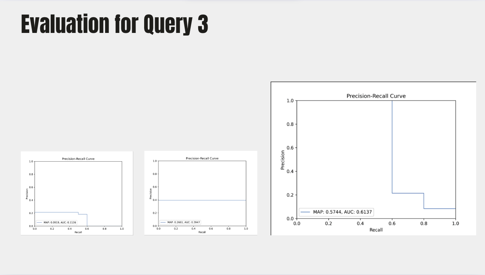

# Medical Drugs Search Engine (Solr)

This project implements an information retrieval system for medical drug documents using Apache Solr. The goal is to compare the performance of three different search approaches—schemeless indexing, schema-based indexing with boosts, and hybrid semantic search using `all-MiniLM-L6-v2`—on three distinct queries, evaluating robustness, precision, recall, and accuracy.


## Project Overview

We built a search engine over a corpus of drug-related documents scraped from [drugs.com](https://www.drugs.com). Each document was manually labeled as **relevant** or **non-relevant** for three target queries. The search engine variants are:

- **Schemeless Solr**: Indexing without a predefined schema.
- **Schema-based Solr**: Using `schema.json` with custom field definitions and boost factors.
- **Hybrid Search**: Incorporating semantic embeddings via `all-MiniLM-L6-v2` for re-ranking.

We evaluated each system on three queries to compare robustness, precision, recall, and accuracy.

---

## Repository Structure

```bash
├── Querie1/                            # Query results, for each system
│   ├─── sys1                           # Folder for specific query
│   │    ├──  qrels_trec.txt            # qrels in trec format
│   │    ├──  qrels.txt                 # regular qrels
│   │    ├──  results_sys1_trec.txt     # results in trec format
│   │    └──  results_sys1_qrels.txt    # results in qrels format
│   ├──  sys2
│   └─── sys3     
│
├── Querie2/              +
│   ├── sys1/          
│   ├── sys2/
│   └── sys3/
├── Querie3/
│   ├── sys1/           
│   ├── sys2/
│   └── sys3/ 
│
│
├── drugs.json          # Json file with scrapped input data
│
├── get_embedding.py    # Get embeddings for semantic hybrid model
│
├── plot_pr.py          # Script to plot results for each model
├── qrels2trec.py       # Script that Converts from qrels to trec format
├── solr2trec.py        # Converts from solr output to trec format
├── query_embedding.py  # Script to prompt a formatted query into hybrid model
├── plot_pr.py          # Script to plot results for each model
│
│
├── schema.json         # Normal schema, used in second model
├── schema_vectors.json # Schema, used in hybrid model
│
├── stopwords.txt         # Text file with stopwords for queries
├── synonyms.txt          # Text file with synonyms for queries
│
└── README.md
```

---

## Installation

1. **Prerequisites**
   - Java 8+ (for Solr)
   - Apache Solr 8.x or 9.x
   - Python 3.8+


3. **Python Environment**
   ```bash
   python3 -m venv venv
   source venv/bin/activate
   pip install -r requirements.txt
   ```

---

## Data Collection & Preparation

1. **Scraping**
   - Data in "drugs.json" was scrapped from drugs.com
   - Parsed into JSON 

2. **Manual Labeling**
   - Each document was manually tagged as **relevant** or **non-relevant** for each of the three queries.

---

## Schema Configuration

- **`schema.json`** defines field types, analyzers, and boost factors.
- Boosts applied to critical fields (e.g., `medical_condition^4.0`, `description^3`).
- Compare against schemeless mode by indexing the same documents into a schemeless core.

---

## Indexing & Search

- **Schemeless Indexing**: `query_solr.py` posts raw JSON to Solr (use `query_schema_no_boost.json`)
- **Schema-based Indexing**: First, post `schema.json`, and then use `query_schema.json` with `query_solr.py`
- **Hybrid Search**: First, post `schema_vectors.json`, and then use `query_schema.json` with `query_embeddings.py`
  1. Query Solr to retrieve top-N results.
  2. Encode queries & documents with `all-MiniLM-L6-v2`.
  3. Re-rank results by cosine similarity.

---

## Testing Methodology

- Three distinct queries were executed against all three systems.
- For each query-system pair, compute:
  - **Precision**
  - **Recall**
  - **Accuracy**
  - **F1-score**

---

## Results & Visualization

*Results images available in `images/` and referenced below.*
In each image, the three columns represent system1, 2 and 3, respectively.

- **Query 1**: 
               

- **Query 2**: 
               

- **Query 3**: 
               

Overall, we can easily see that hybrid search vastely outperforms the first 2 systems, and also that it holds the highest precision values for each recall. 

---

## Contributing

Contributions—bug reports, improved evaluation scripts, or new search strategies—are welcome via pull requests.

---

## License

This project is licensed under the MIT License. See [LICENSE](LICENSE) for details.

---

## Acknowledgments

- [Drugs.com](https://www.drugs.com) for the source corpus.

---


